# 日本文化理解力ベンチマーク 分析レポート

**Japanese Culture Understanding Benchmark — Analysis Report**

---

## 目次

1. [はじめに](#第1章-はじめに)
2. [ベンチマークの設計](#第2章-ベンチマークの設計)
3. [llm-jp v4の評価結果](#第3章-llm-jp-v4の評価結果)
   - [3.1 総合評価](#31-総合評価)
   - [3.2 Type A（概念理解）](#32-type-a-詳細概念理解)
   - [3.3 Type B（応用力）](#33-type-b-詳細応用力)
   - [3.4 Type C（弁別力）](#34-type-c-詳細弁別力)
   - [3.5 JamC-QA（知識）](#35-jamc-qa-詳細知識)
   - [3.6 軸横断分析](#36-軸横断分析)
4. [ベンチマークの有効性検証](#第4章-ベンチマークの有効性検証)
   - [4.1 軸間の独立性](#41-軸間の独立性)
   - [4.2 モデル弁別力](#42-モデル弁別力)
   - [4.3 評価基準の妥当性](#43-評価基準の妥当性)
   - [4.4 問題設計の適切性](#44-問題設計の適切性)
5. [含意](#第5章-含意)
   - [5.1 日本文化理解の現状](#51-日本文化理解の現状)
   - [5.2 モデルアーキテクチャの影響](#52-モデルアーキテクチャの影響)
   - [5.3 SFTの改善可能性](#53-sftの改善可能性)
6. [課題と限界](#第6章-課題と限界)
7. [まとめ](#第7章-まとめ)

---

## 第1章: はじめに

### 背景と目的

大規模言語モデル（LLM）の日本語能力は急速に向上しているが、**日本文化に対する深い理解力**を体系的に測定するベンチマークは存在しなかった。既存の日本語ベンチマークは主に言語知識・推論能力を測定するものであり、文化的文脈の理解や文化間比較の能力は測定対象外であった。

本ベンチマークは、LLMの日本文化理解力を**4つの独立した軸**で測定する：

| 軸 | 測定対象 | 問題形式 | 問題数 |
|---|---------|---------|-------|
| **Type A** | 概念理解 | 自由記述（200字以内） | 100 |
| **Type B** | 応用力 | 自由記述（150字以内） | 100 |
| **Type C** | 弁別力 | 自由記述（200字以内） | 100 |
| **JamC-QA** | 文化知識 | 4択（4-shot） | 100 |

### 評価対象モデル（8モデル）

| モデル名 | ID | 開発元 | パラメータ数 | 特徴 |
|---------|---|-------|------------|-----|
| Claude Sonnet 4.5 | claude | Anthropic | 非公開 | API・ベースライン（上限参考） |
| llm-jp v4 8B | llmjp-v4-8b | LLM-jp | 8B | ベースモデル（instruct版） |
| llm-jp v4 SFT1 | llm-jp-4-swallow-sft1 | LLM-jp/Swallow | 8B+LoRA | SFT後モデル |
| Qwen3 8B | qwen3-8b | Alibaba | 8B | マルチリンガルベース |
| Qwen3-Swallow 8B | qwen3-swallow-8b | Swallow/Tokyo Tech | 8B | Swallow RL適用 |
| GPT-OSS 20B | gpt-oss-20b | OpenAI | 20B | 英語主体ベース |
| GPT-OSS-Swallow 20B | gpt-oss-swallow-20b | Swallow/Tokyo Tech | 20B | Swallow RL適用 |
| Nemotron Nano 9B | nemotron-nano-9b | NVIDIA | 9B | 日本語対応 |

### llm-jp v4 SFT1 の作成方法

llm-jp v4 SFT1は、llm-jp v4 8B（`v4-8b-decay2m-ipt_v3.1-instruct4`）をベースに、**QLoRA（4bit量子化 + LoRA）** による**2段階SFT**で作成した。高速化ライブラリ Unsloth を使用し、Google Colab A100 80GB 上で学習を実施した。

**LoRA設定:**

| 項目 | 値 |
|------|-----|
| rank (r) | 16 |
| alpha | 16 |
| 対象モジュール | q_proj, k_proj, v_proj, o_proj, gate_proj, up_proj, down_proj |
| dropout | 0 |
| 学習可能パラメータ | 41,943,040 / 8,632,143,872 (0.49%) |

**Stage 1: 一般会話SFT**

| 項目 | 値 |
|------|-----|
| データセット | `tokyotech-llm/lmsys-chat-1m-synth`（GPT-OSS variant） |
| ライセンス | Apache 2.0 |
| サンプル数 | 10,000件（329,818件から抽出） |
| 学習率 | 2e-4（cosineスケジュール、warmup 100 steps） |
| バッチサイズ | 16（4 × gradient accumulation 4） |
| エポック数 | 1 |

LMSYS-Chat-1Mをベースに合成されたマルチターン会話データを使用し、一般的な会話能力・指示追従能力を獲得させた。

**Stage 2: 日本語専門タスクSFT**

| 項目 | 値 |
|------|-----|
| データセット | `tokyotech-llm/Swallow-Nemotron-Post-Training-Dataset-v1`（config: GPT-OSS-Ja-202601） |
| ライセンス | CC BY 4.0 |
| サンプル数 | 9,999件（code / math / stem 各3,333件） |
| 学習率 | 5e-5（Stage 1より低く設定、cosineスケジュール、warmup 50 steps） |
| バッチサイズ | 16（4 × gradient accumulation 4） |
| エポック数 | 1 |

Stage 1で獲得した一般的な会話能力の上に、日本語のコード・数学・STEM分野の専門的なタスク処理能力を追加した。学習率をStage 1の1/4に抑え、獲得済みの能力を保持しつつ新たな知識を学習する設計とした。

---

## 第2章: ベンチマークの設計

### 4軸設計の哲学

本ベンチマークは「文化理解」を多角的に捉えるために、4つの独立した評価軸を設計した：

1. **Type A（概念理解）**: 日本文化の抽象概念（「和」「道」「型」など）をどれだけ正確かつ深く説明できるか
2. **Type B（応用力）**: 抽象概念が具体的な文化要素（畳、茶道、相撲など）にどう表れるか説明できるか
3. **Type C（弁別力）**: 日本の概念と外国の類似概念（中国・西洋・韓国）の違いを的確に弁別できるか
4. **JamC-QA（文化知識）**: 日本文化に関する事実的知識を正確に保持しているか

### 問題構成

- **13テーマ**: 和・型・道・気・節・情・忠・神・仏・縁・信・徳・美
- **100キーワード**: 各テーマに5〜10のキーワード
- **100文化要素**: Wikipedia検証済みの具体的文化要素（Type B用）
- **100比較ペア**: 中国42件・西洋51件・韓国7件（Type C用）

### LLM-as-a-Judge 方法論

Type A/B/Cは**Claude Sonnet 4.5**によるLLM-as-a-Judge方式で評価。各問題に対し、人間が作成した**参照回答**と比較して4観点で1〜5点の採点を行う。

| 評価軸 | 観点1 | 観点2 | 観点3 | 観点4 |
|-------|-------|-------|-------|-------|
| Type A | 正確性 | 文化的深度 | 要点網羅性 | 簡潔性 |
| Type B | 正確性 | 文化的深度 | 場面適合性 | 簡潔性 |
| Type C | 正確性 | 文化的深度 | 対比の明確さ | 簡潔性 |

---

## 第3章: llm-jp v4の評価結果

### 3.1 総合評価

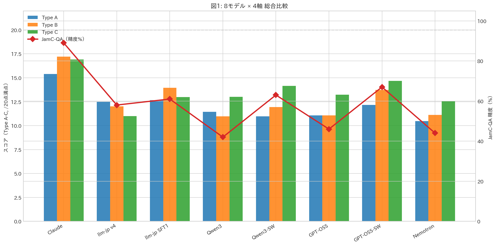

**図1**は8モデルの4軸スコアを比較したものである。Claude Sonnet 4.5が全軸で突出した性能を示す。

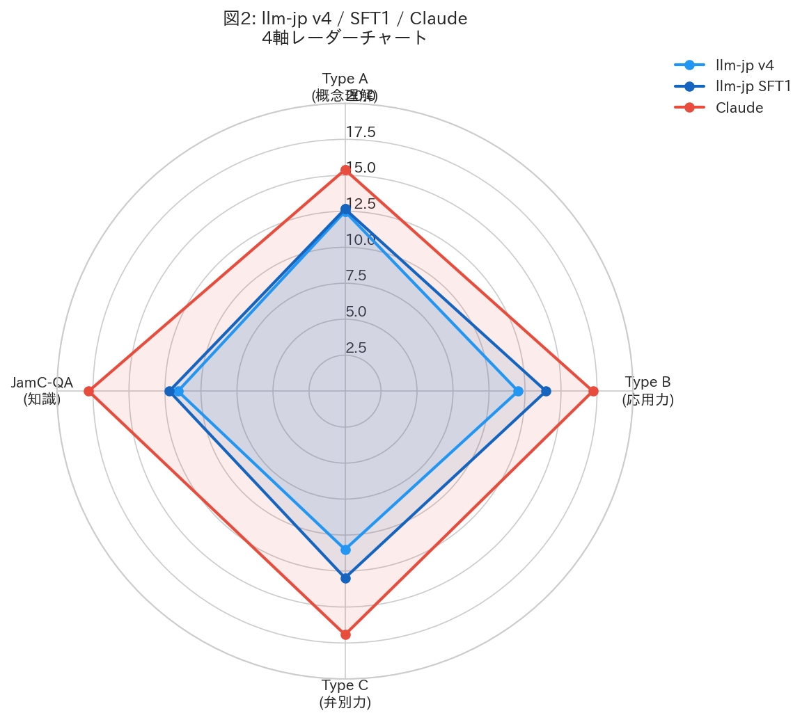

**図2**はllm-jp v4のベースモデル・SFT後・Claudeの3者を4軸で比較したレーダーチャートである。SFTにより全軸で改善が見られるが、Claudeとの差は依然として大きい。

#### 総合ランキング

| モデル | Type A (/20) | Type B (/20) | Type C (/20) | JamC-QA (%) | 合計 (/80) |
|:------|:---:|:---:|:---:|:---:|:---:|
| Claude Sonnet 4.5 | 15.39 | 17.21 | 16.92 | 89.0 | 67.32 |
| GPT-OSS-Swallow 20B | 12.16 | 13.73 | 14.67 | 67.0 | 53.96 |
| llm-jp v4 SFT1 | 12.66 | 13.96 | 12.98 | 61.0 | 51.80 |
| Qwen3-Swallow 8B | 10.98 | 11.94 | 14.16 | 63.0 | 49.68 |
| llm-jp v4 8B | 12.49 | 12.02 | 11.00 | 58.0 | 47.11 |
| GPT-OSS 20B | 11.07 | 11.07 | 13.23 | 46.0 | 44.57 |
| Qwen3 8B | 11.45 | 10.96 | 13.01 | 42.0 | 43.82 |
| Nemotron Nano 9B | 10.47 | 11.13 | 12.55 | 44.0 | 42.95 |

**主な知見:**
- Claude Sonnet 4.5が合計67.32/80で首位。2位のGPT-OSS-Swallow（53.96）との差は13ポイント以上。
- llm-jp v4 SFT1は合計51.80で3位。ベースの llm-jp v4（47.11）から+4.69ポイントの改善。
- Swallow RLを適用した3モデル（GPT-OSS-Swallow, llm-jp SFT1, Qwen3-Swallow）がいずれも上位に位置。

---

### 3.2 Type A 詳細（概念理解）

Type Aは、日本文化の抽象概念を200字以内で説明する課題。4観点（正確性・文化的深度・要点網羅性・簡潔性）で各1-5点の採点。

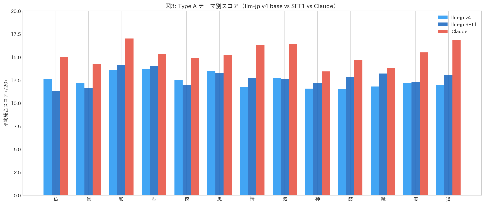

**図3**はType Aのテーマ別スコアを示す。llm-jp v4ベースとSFT1はほぼ同水準であり、Type Aにおける概念理解力はSFTによる改善が限定的であることを示唆する。Claudeは全テーマで安定して高いスコアを示す。

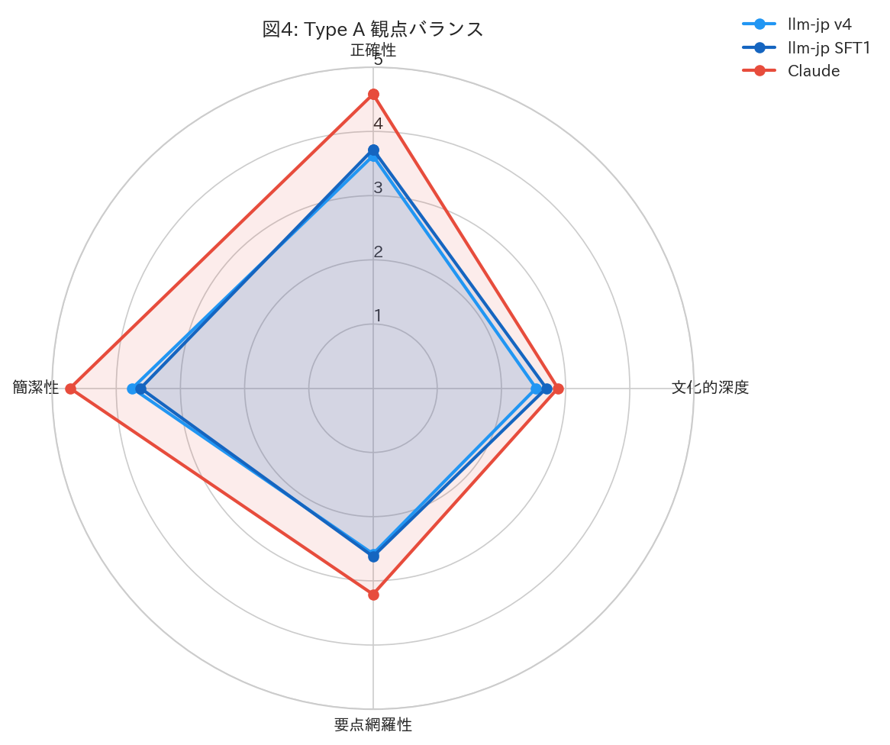

**図4**は3モデルの観点バランスを示すレーダーチャート。全モデルに共通して**文化的深度**（平均2.88〜3.0程度）が最も低く、**簡潔性**が最も高い。文化概念の歴史的・精神的背景の深い理解がLLM全般の課題であることがわかる。

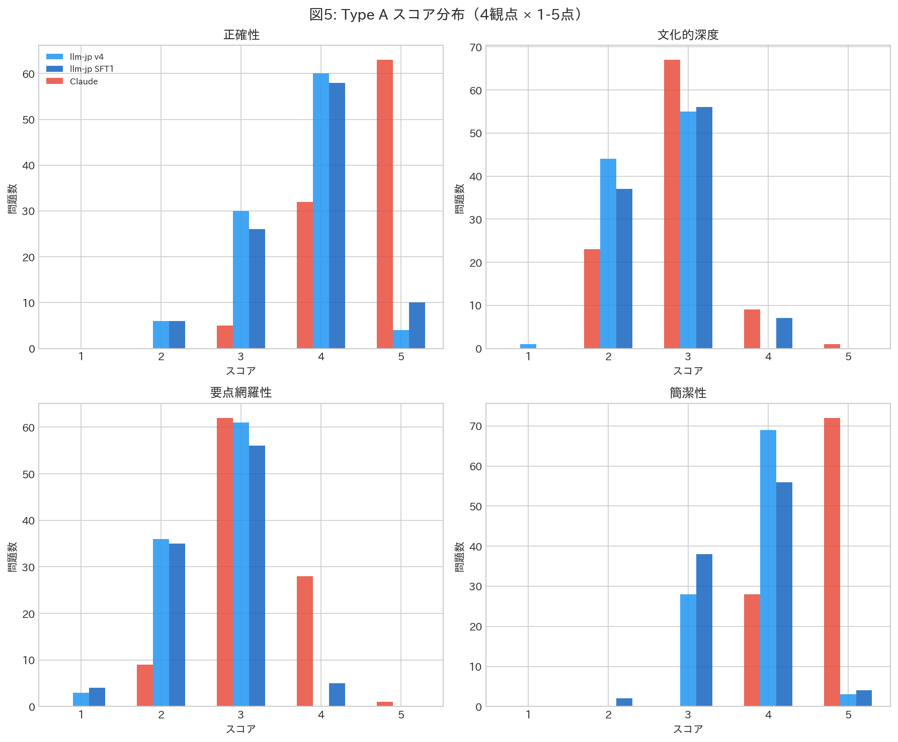

**図5**はType Aの4観点のスコア分布。簡潔性は4-5点に集中する天井効果を示す一方、文化的深度は2-3点の正規分布に近い形状で弁別力が高い。

---

### 3.3 Type B 詳細（応用力）

Type Bは、抽象概念が具体的な文化要素にどう表れるかを150字以内で説明する課題。4観点（正確性・文化的深度・場面適合性・簡潔性）で採点。

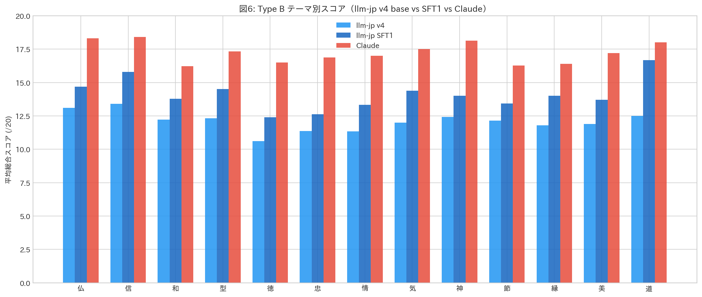

**図6**はType Bのテーマ別スコア。llm-jp v4 SFT1はベースモデルから明確な改善を示し、特に「仏」「道」「神」で大きな伸びを見せる。

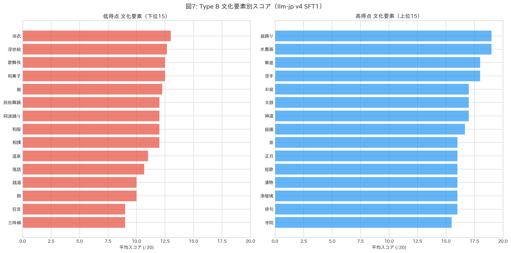

**図7**はllm-jp v4 SFT1の文化要素別スコア。上位要素（和菓子、歌舞伎など）と下位要素の間に大きな差があり、モデルの文化知識の偏りを示す。

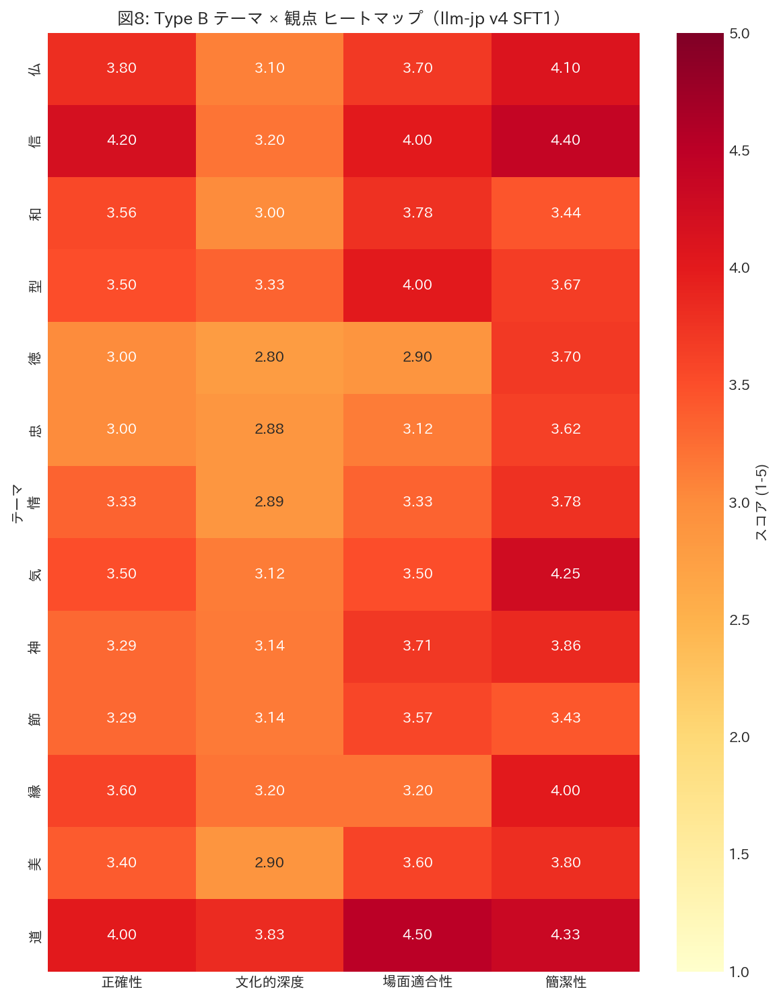

**図8**はllm-jp v4 SFT1のType Bにおけるテーマ×観点のヒートマップ。文化的深度が全テーマで相対的に低いパターンが明確。

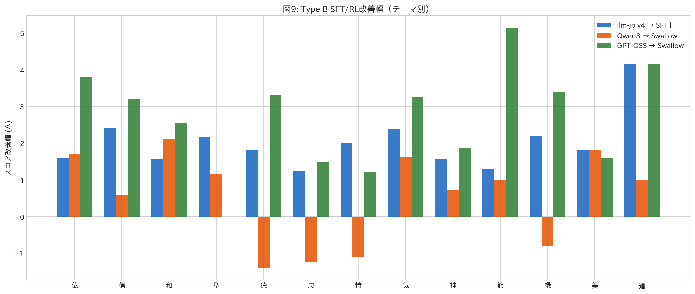

**図9**は3つのSFT/RLペアにおけるテーマ別改善幅。GPT-OSS → Swallowの改善幅が最も大きく（平均+2.66点）、テーマによる改善のばらつきも見られる。

---

### 3.4 Type C 詳細（弁別力）

Type Cは、日本の文化概念と外国（中国・西洋・韓国）の類似概念を比較し、日本文化の特徴を踏まえて違いを説明する課題。

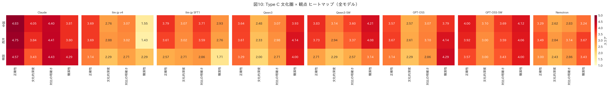

**図10**は全モデルの文化圏×観点ヒートマップ。モデル間で文化圏による得意・不得意パターンが異なることがわかる。

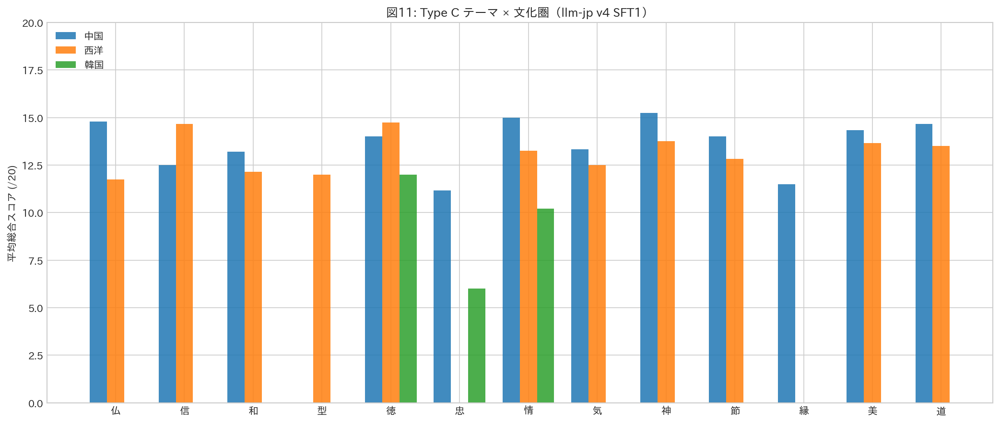

**図11**はllm-jp v4 SFT1のテーマ×文化圏クロス集計。韓国との比較問題は7件のみで統計的信頼性に注意が必要であるが、テーマによっては大きな差が見られる。

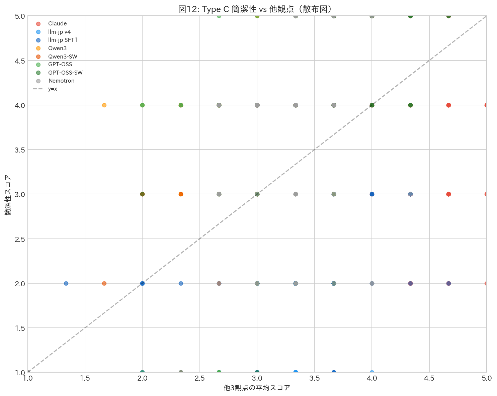

**図12**はType Cにおける簡潔性と他3観点の関係を示す散布図。Type Cでは比較対象の説明が必要なため、高品質な回答ほど簡潔性が犠牲になる傾向がある。これはType A/Bとは異なるパターンであり、Type C特有の課題である。

**簡潔性の軸間比較:**
- Type A 簡潔性: mean=3.59, std=0.79
- Type B 簡潔性: mean=3.71, std=0.94
- Type C 簡潔性: mean=3.48, std=1.22

Type Cの簡潔性は分散が大きく、モデルによって大きく異なることを示している。

---

### 3.5 JamC-QA 詳細（知識）

JamC-QAは日本文化に関する4択知識問題（100問）。カテゴリは culture（文化）49問、custom（風習）49問、regional_identity（風土）2問。

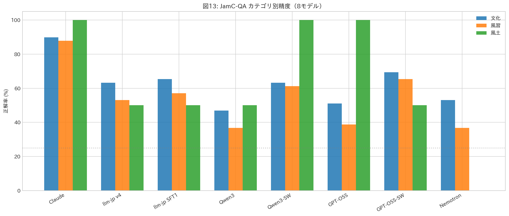

**図13**は8モデルのカテゴリ別正解率。Claude（89%）が他を大幅に上回る。GPT-OSS（23%）は4択ランダム（25%）に近く、事実的知識の保持が極めて限定的。

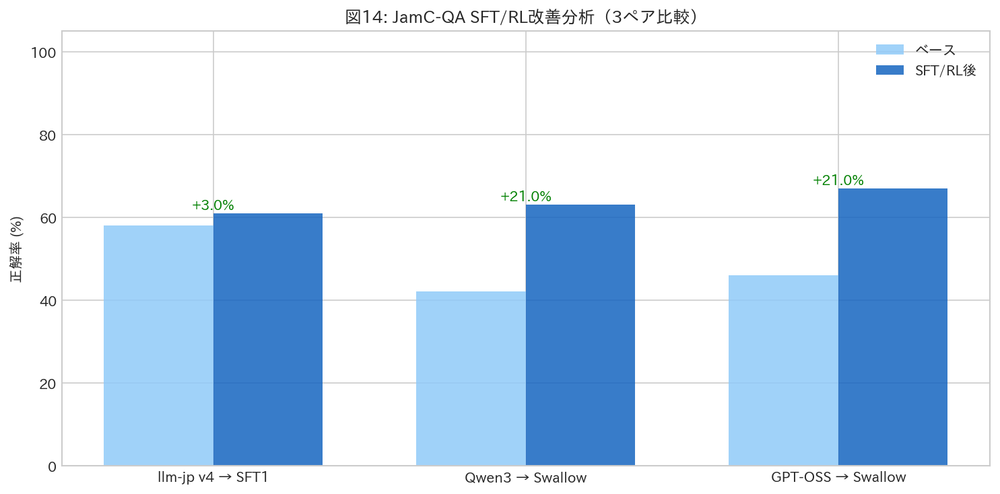

**図14**はSFT/RLによる改善分析。3ペアとも改善が確認され、特にGPT-OSS → Swallow（+21ポイント）の改善が顕著。Swallow RLによる日本文化知識の注入効果が明確に表れている。

---

### 3.6 軸横断分析

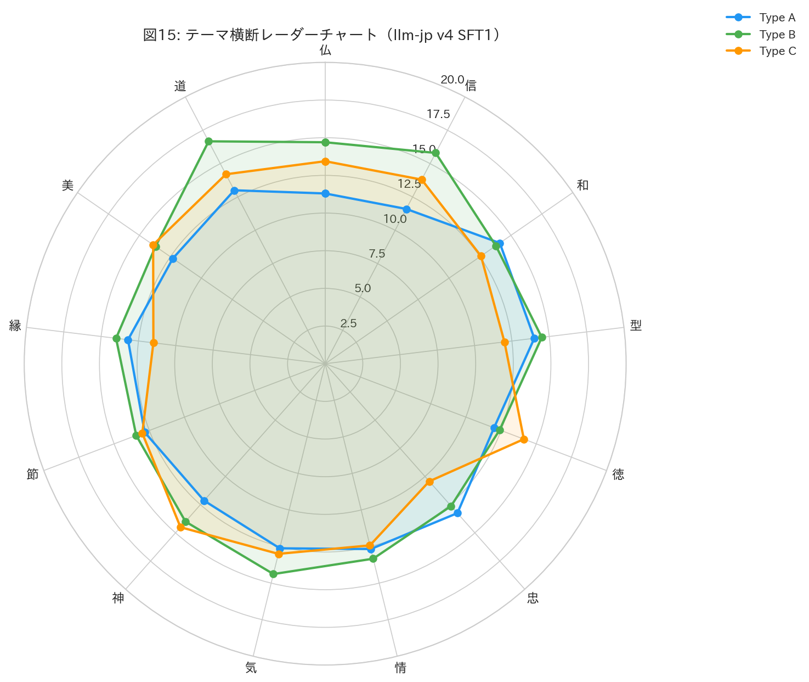

**図15**はllm-jp v4 SFT1のテーマ横断パフォーマンス。Type A/B/Cでテーマ別の得意・不得意パターンが異なり、特に「情」「道」「気」で安定して高い性能を示す。

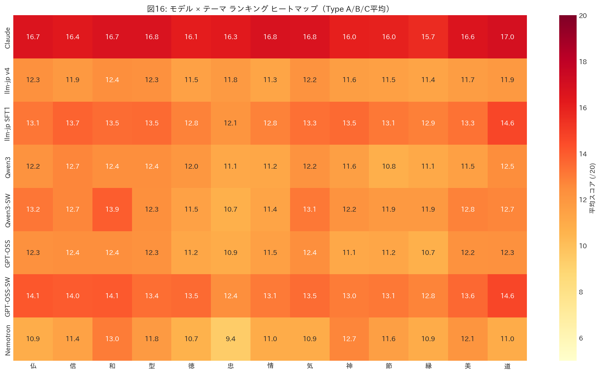

**図16**は全モデルのテーマ別平均スコア（Type A/B/C平均）。Claudeが全テーマで最高値を示すが、テーマ間の差は小さい。オープンモデル間では「情」「道」が共通して高い傾向。

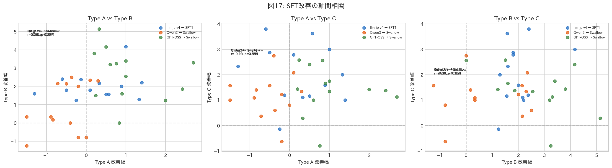

**図17**はSFT/RL改善幅のテーマ別軸間相関。Type B（応用力）とType C（弁別力）の改善は比較的連動する傾向がある一方、Type A（概念理解）の改善は他軸と独立的である。

---

## 第4章: ベンチマークの有効性検証

### 4.1 軸間の独立性

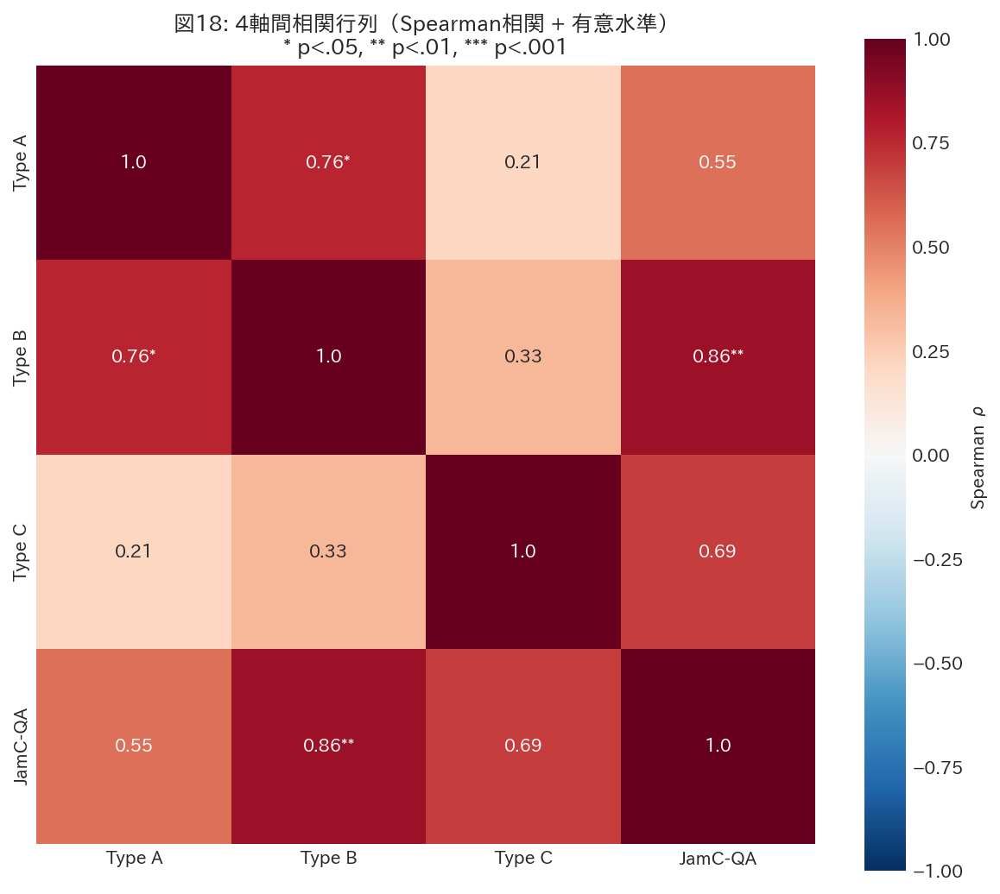

**図18**は4軸間のSpearman相関行列。主な結果：

| ペア | Spearman ρ | p値 | 解釈 |
|-----|:---:|:---:|------|
| Type A ↔ Type B | 0.762 | 0.028 | 有意な正相関 |
| Type B ↔ JamC-QA | 0.857 | 0.007 | 強い有意な正相関 |
| Type C ↔ JamC-QA | 0.690 | 0.058 | 境界的相関 |
| Type A ↔ Type C | 0.214 | 0.610 | 独立 |
| Type A ↔ JamC-QA | 0.548 | 0.160 | 独立 |
| Type B ↔ Type C | 0.333 | 0.420 | 独立 |

Type AとType Cは相関が低く（ρ=0.214）、概念理解力と弁別力は独立した能力であることを示唆する。一方、Type BとJamC-QAは強い相関（ρ=0.857）を示し、応用力と知識が連動していることを示す。

**ただし**、8モデルのみでの相関分析は検定力が低く、統計的有意性の解釈には慎重さが必要である。

---

### 4.2 モデル弁別力

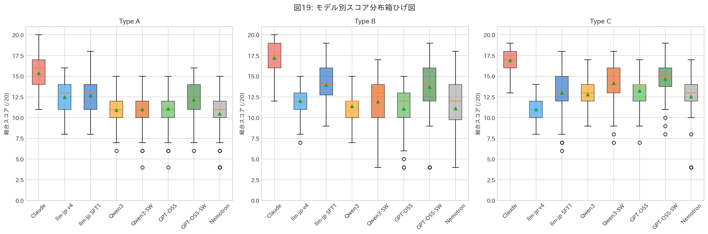

**図19**はType A/B/Cのモデル別スコア分布。Kruskal-Wallis検定の結果：

| 軸 | H統計量 | p値 | η² (効果量) |
|---|:---:|:---:|:---:|
| Type A | 256.53 | 1.13e-51 | 0.315 |
| Type B | 300.34 | 5.12e-61 | 0.370 |
| Type C | 353.33 | 2.38e-72 | 0.437 |

全軸で高度に有意なモデル間差異が確認され（p < 0.001）、効果量も中〜大（η² = 0.315〜0.437）。本ベンチマークはモデルの日本文化理解力の差を効果的に弁別できている。

**天井/床効果:**
- Type B Claude: 天井（≥19点）34.0%の問題 → 天井効果あり
- Type B Nemotron: 床（≤5点）21.0%の問題 → 床効果あり
- Type C Claude: 天井（≥19点）13.0%

Claudeに対するType Bの天井効果は、より困難な問題設計の余地を示唆する。

---

### 4.3 評価基準の妥当性

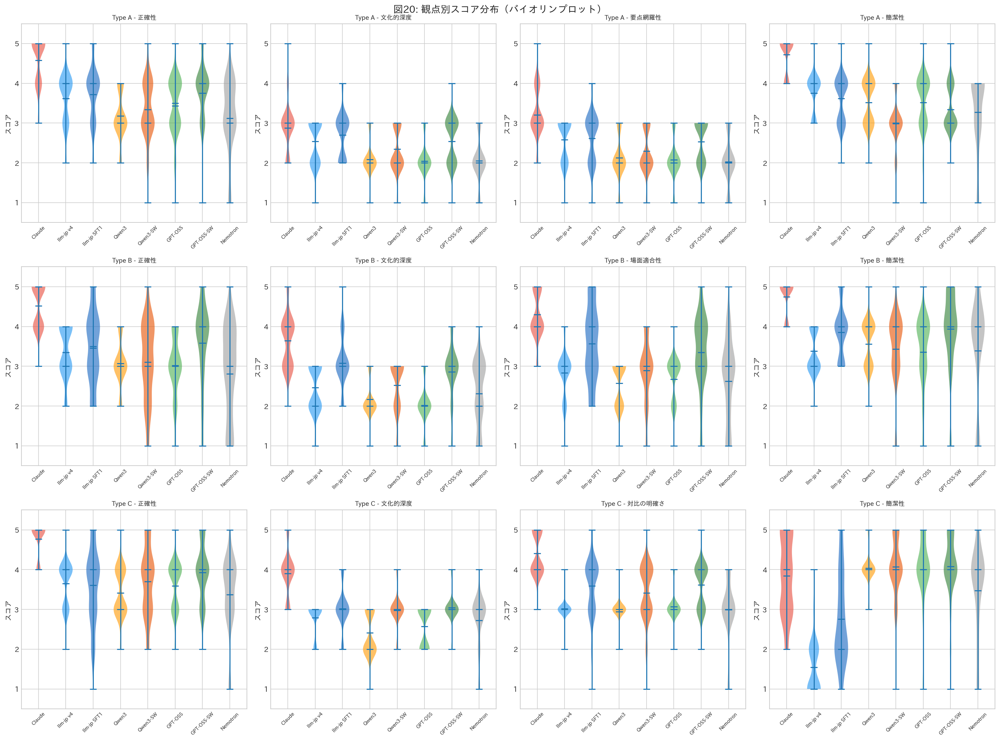

**図20**は全軸・全観点のバイオリンプロット。「文化的深度」は全軸で2-4点に分布し弁別力が高い。「簡潔性」はType A/Bでは高スコアに集中するが、Type Cでは分散が大きい。

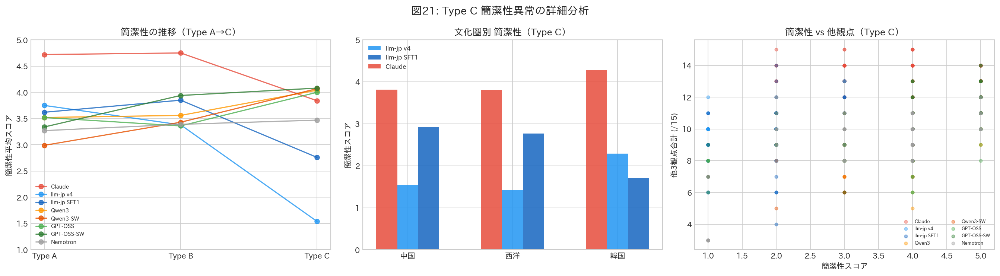

**図21**はType C簡潔性の詳細分析。3パネル構成：
1. **簡潔性の推移**: Type A→Cにかけて、llm-jp系は低下、Qwen系・GPT-OSS系は上昇する対照的パターン
2. **文化圏別簡潔性**: 文化圏による差は小さい
3. **簡潔性 vs 他観点**: Type Cでは高品質回答（他3観点高得点）と簡潔性がトレードオフ

**Mann-Whitney U検定（Type A vs Type C 簡潔性）:**

全8モデルでType AとType Cの簡潔性に有意差（p < 0.05）が確認された。特に注目すべきは方向の違い：
- llm-jp系: Type A > Type C（比較説明で冗長化）
- Qwen/GPT-OSS系: Type A < Type C（比較問題で簡潔化）

この逆転パターンは、モデルのアーキテクチャや学習データの違いを反映している可能性がある。

---

### 4.4 問題設計の適切性

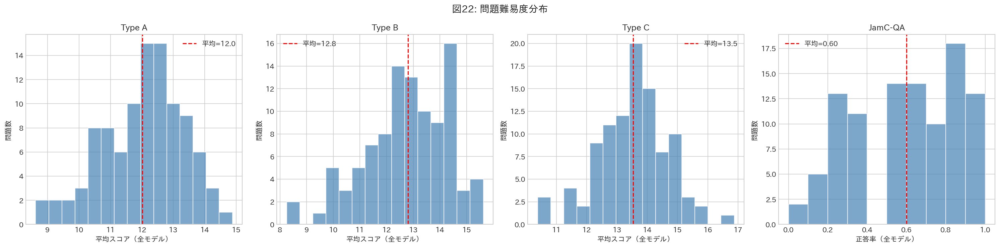

**図22**は問題難易度分布。Type A/B/Cではほぼ正規分布に近い形状を示し、適度な難易度のばらつきがある。JamC-QAでは全モデル正解（1.0）と全モデル不正解（0.0）の両極に集中する傾向があり、中間難易度の問題が少ない。

**項目弁別力分析:**

| 軸 | 平均弁別力 | 良好(>0.3) | 不良(<0.1) |
|---|:---:|:---:|:---:|
| Type A | 0.696 | 94/100 | 2/100 |
| Type B | 0.694 | 97/100 | 2/100 |
| Type C | 0.728 | 98/100 | 1/100 |

全軸で94%以上の問題が良好な弁別力（r > 0.3）を示し、問題設計の質が高いことが確認された。

---

## 第5章: 含意

### 5.1 日本文化理解の現状

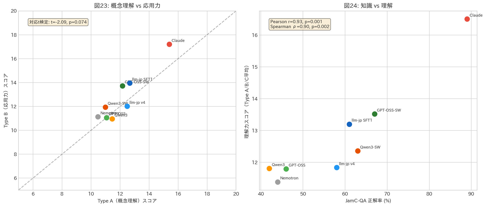

**図23**は概念理解（Type A）と応用力（Type B）の関係。多くのモデルが対角線上またはその上方に位置し、**具体的な文脈（文化要素）が与えられることで応用的な説明が概念的説明を上回る**傾向がある。

**図24**は知識（JamC-QA）と理解力（Type A/B/C平均）の関係。知識と理解は強く相関しており（Spearman ρ=0.857）、事実的知識の保持と文化理解は連動していることを示す。

---

### 5.2 モデルアーキテクチャの影響

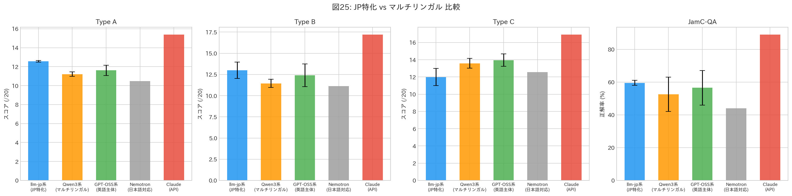

**図25**はモデルファミリー別の平均性能比較。主な知見：
- **llm-jp系（JP特化）**: Type A（概念理解）で高い性能を示すが、Type C（弁別力）ではQwen系に劣る
- **Qwen系（マルチリンガル）**: Type C（弁別力）で相対的に高い性能。多言語知識が文化間比較に寄与している可能性
- **GPT-OSS系**: Swallow RL前は知識（JamC-QA）で最低レベルだが、RL後は大幅に改善

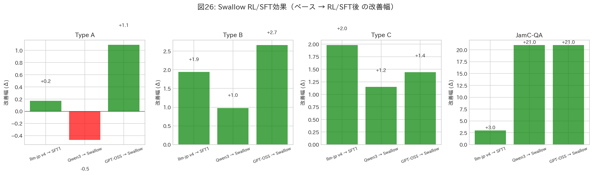

**図26**はSwallow RL/SFTによる改善幅。主な知見：
- **GPT-OSS → Swallow**: 全軸で最大の改善幅。特にType BとJamC-QAで大きな効果
- **llm-jp v4 → SFT1**: Type B/Cで有意な改善。Type Aでの改善は限定的
- **Qwen3 → Swallow**: Type Cで顕著な改善。JamC-QAでも+21%の大幅改善

---

### 5.3 SFTの改善可能性

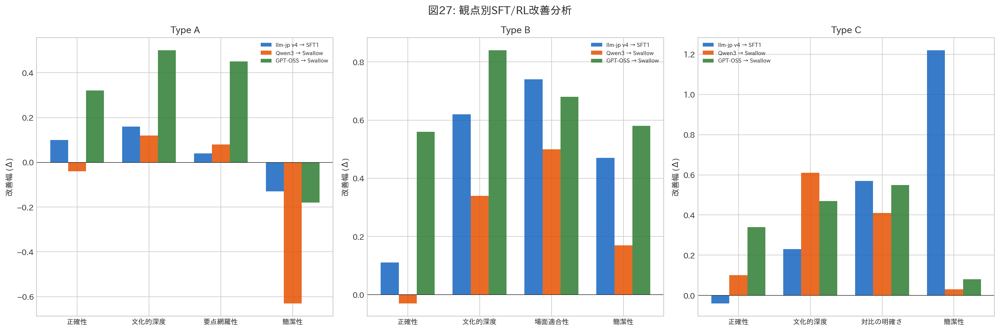

**図27**は観点レベルでのSFT/RL改善分析。主な知見：
- **文化的深度**が全ペア・全軸で一貫して改善されており、SFT/RLが文化的知識の深化に効果的
- **場面適合性**（Type B）の改善幅が大きく、具体的文脈での適切な回答生成にSFTが寄与
- **簡潔性**の改善はペアにより方向が異なり、一貫した効果は見られない

**Wilcoxon符号順位検定によるSFT改善の統計的有意性:**

| ペア | Type A (Δ) | Type B (Δ) | Type C (Δ) |
|------|:---:|:---:|:---:|
| llm-jp v4 → SFT1 | +0.17 (n.s.) | **+1.94*** (r=0.666) | **+1.98*** (r=0.652) |
| Qwen3 → Swallow | +0.06 (n.s.) | **+0.57*** (r=0.246) | **+1.36*** (r=0.571) |
| GPT-OSS → Swallow | **+1.09*** (r=0.517) | **+2.66*** (r=0.596) | **+1.44*** (r=0.531) |

*\*\*\* p < 0.001, n.s. = not significant*
*r = 効果量（Z/√N）*

Type Aでの改善は llm-jp と Qwen3 では有意でないが、GPT-OSSでは有意。これは、概念理解力の改善には基礎的な日本語能力や日本文化知識が前提条件となることを示唆する（GPT-OSSは英語主体のため、Swallow RLによる日本語化の効果が大きい）。

一方、Type B/Cではすべてのペアで統計的に有意な改善（p < 0.001）が確認され、効果量も中〜大（r = 0.246〜0.666）。SFT/RLは応用力と弁別力の改善に一貫して有効であることが示された。

---

## 第6章: 課題と限界

### 6.1 ベンチマーク設計上の課題

1. **LLM-as-a-Judge のバイアス**: 評価者としてClaude Sonnet 4.5を使用しているため、Claudeの回答が不当に高く評価される可能性がある。複数の評価者モデルによるクロスバリデーションが必要。

2. **簡潔性の天井効果**: 特にType A/Bでは簡潔性スコアが天井に張り付く傾向があり、弁別力が低い。制約条件（文字数制限）が緩すぎる可能性がある。

3. **Type C簡潔性の逆転現象**: Type Cでは比較対象の説明が必要なため、簡潔性と内容の充実がトレードオフになり、他のTypeとは異なるパターンを示す。簡潔性の基準設計に改善の余地がある。

4. **韓国比較の少なさ**: Type Cの比較対象は中国42件・西洋51件に対し韓国7件と著しく少なく、韓国との比較分析の信頼性が低い。

5. **JamC-QAのカテゴリ偏り**: regional_identity（風土）カテゴリが2問のみで、統計的に信頼性のある分析が困難。

### 6.2 評価方法の限界

1. **参照回答依存性**: LLM-as-a-Judgeは人間が作成した参照回答との比較に基づくため、参照回答の品質が評価結果を大きく左右する。

2. **文化的深度の測定困難性**: 「文化的深度」は主観的な概念であり、一貫した採点基準の適用が難しい。スコアのばらつきが大きい。

3. **再現性の課題**: LLMの確率的な性質上、同一問題への回答やLLM-as-a-Judgeの採点結果が毎回同一とは限らない。

### 6.3 モデル評価の限界

1. **APIモデルとオープンモデルの条件差**: Claudeは非公開のAPIモデルであり、パラメータ数やアーキテクチャが異なるため、直接的な比較には注意が必要。

2. **推論時の条件統一**: 各モデルの推論パラメータ（温度、max_tokens等）が完全に統一されていない可能性がある。

---

## 第7章: まとめ

### 主要な知見

1. **Claudeが全軸で最高性能**: Claude Sonnet 4.5は4軸すべてで他モデルを大幅に上回り、日本文化理解のベースラインとして機能する。ただし、LLM-as-a-Judgeバイアスの可能性に留意が必要。

2. **llm-jp v4のSFT効果**: llm-jp v4 → SFT1へのLoRA SFTにより、Type B（+1.94点, p<0.001）およびType C（+1.98点, p<0.001）で有意な改善。Type Aでの改善は限定的（+0.17点, n.s.）。

3. **Swallow RLの効果**: Qwen3 → Qwen3-Swallow、GPT-OSS → GPT-OSS-Swallowのいずれも、Swallow RLにより有意な改善が確認された。改善幅はベースモデルの初期性能に依存する傾向がある。

4. **概念理解と応用力のギャップ**: 多くのモデルでType A（概念理解）よりType B（応用力）の方が高スコアとなる傾向があり、具体的な文脈が与えられることで説明能力が向上することを示唆。

5. **文化的深度の共通課題**: 全モデル・全軸で「文化的深度」が最も低いスコアとなる傾向があり、歴史的・精神的背景の深い理解がLLMにとって困難な課題であることを示す。

6. **簡潔性の設計課題**: Type A/Bでは簡潔性が天井効果を示す一方、Type Cでは比較説明の必要性から簡潔性が低下する。評価基準の再設計が課題。

7. **ベンチマークの有効性**: Kruskal-Wallis検定（η² = 0.315〜0.437）と項目弁別力分析（良好率94%以上）により、本ベンチマークがモデル間の日本文化理解力の差を効果的に測定できることが確認された。

### 今後の方向性

- 複数LLM評価者によるバイアス検証
- 韓国・東南アジアなど比較文化圏の拡充
- 文化的深度の改善に特化したSFT/RLデータセットの構築
- 動的な難易度調整メカニズムの導入
- 多言語展開（英語話者の日本文化理解測定）

---

## 参考文献

- 岡照晃・柴田知秀・吉田奈央. (2025). JamC-QA: 日本固有の知識を問う多肢選択式質問応答ベンチマークの構築. *言語処理学会第31回年次大会発表論文集*, Q2-18. https://www.anlp.jp/proceedings/annual_meeting/2025/pdf_dir/Q2-18.pdf
- 山久瀬洋二. (2023). *日英対訳 日本人のこころ 増補改訂版* (M. A. Cooney, Trans.). IBCパブリッシング.
- tokyotech-llm. (2025). *lmsys-chat-1m-synth* [Data set]. Hugging Face. https://huggingface.co/datasets/tokyotech-llm/lmsys-chat-1m-synth
- tokyotech-llm. (2026). *Swallow-Nemotron-Post-Training-Dataset-v1* [Data set]. Hugging Face. https://huggingface.co/datasets/tokyotech-llm/Swallow-Nemotron-Post-Training-Dataset-v1
- Zheng, L., Chiang, W.-L., Sheng, Y., Zhuang, S., Wu, Z., Zhuang, Y., Lin, Z., Li, Z., Li, D., Xing, E. P., Zhang, H., Gonzalez, J. E., & Stoica, I. (2023). Judging LLM-as-a-Judge with MT-Bench and Chatbot Arena. In *Advances in Neural Information Processing Systems*, *36*, 46595–46623. https://arxiv.org/abs/2306.05685

---

*本レポートの全可視化は `docs/analysis.ipynb` で再現可能。図は `docs/figures/` に保存済み。*
